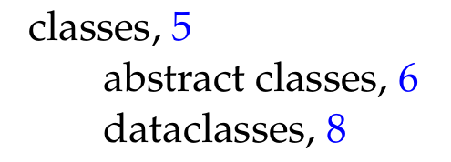

# Index Terms

We can use the `\index` command to define indexing terms right inside our text:

``` markdown
### Code Design
 \index{code design}
```

...

``` markdown
Just what *is* an abstraction\index{abstraction}?
...
```

## Generating the Index

Generating the index takes extra time, so it's off by default. Use the `--index` flag to enable it. Examples:

Generate Chapter 1 with an index just for the chapter:

``` shell
bin/to-pdf chapter1 --index
```

Generate the entire book with an index, using the T&F style:

``` shell
bin/to-pdf --index --tf-format
```

## Advanced Index Options

The `\index` command [offers a number of options][sophisticated-indexing] to structure and format index entries. Here are a few examples useful for us:

### Formatting and Sorting

We can use TeX formatting commands (including math mode) in index entries. If we do, we need to add a sorting label *without* formatting so that the entry gets sorted correctly.


``` markdown
\index{Distribution@\texttt{Distribution}}
```

The entry for `Distribution` uses `\texttt` because `Distribution` is an identifier from our code, and we used `Distribution@` to make sure it gets sorted correctly.

We can also format page numbers. For example, some books use the convention that the page number where a term is first defined is in bold:


``` markdown
An object that we cannot change is called **immutable**\index{immutability|textbf}\index{immutable|see{immutability}}.
```

### Sub-entries

Some more specific topics make more sense when grouped under a more general topic rather than on their own. When this is worth doing is a judgment call.

Example: grouping **abstract classes** and **dataclasses** under **classes**:



``` markdown
### Classes and Interfaces
\index{classes}
```

...

``` markdown
In Python, we can express this idea with a class:
\index{classes!abstract classes}
```

...

``` markdown
##### Dataclasses
\index{classes!dataclasses}
```

### See and see-also

If we want to include synonyms in the index, we can link them together with "see":


``` markdown
**type annotations** \index{type annotations}(also known as "type hints"\index{type hints|see{type annotations}})
```

For terms that aren't synonyms but are closely related, we can use "see also":


``` markdown
### Classes and Interfaces
\index{classes}\index{interfaces|seealso{classes}}
```
